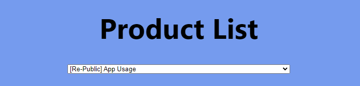

# Product List 

# Installation 

To install the application, first you git clone the app into your local folder by

### `git clone `

Then remove the git-configuration of the cloned repository, and install dependencies

### `rm -rf .git`

### `npm install`

Now you can run the app with 

### `npm start`

My application is using cypress to test. In order to test your application, you can install cypress by 

### `npm install --save-dev cypress`

Then run your test with

### `npm run cypress:open`